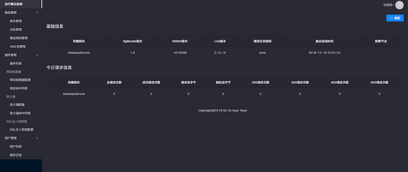
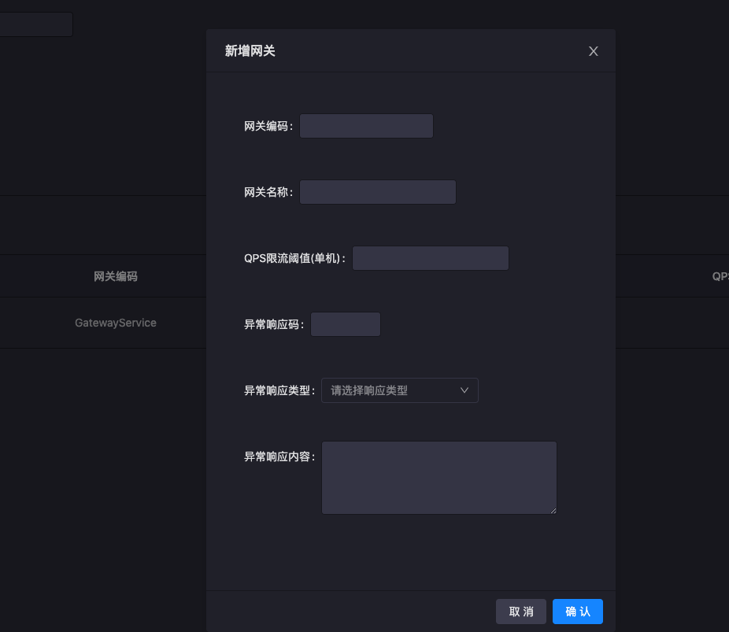
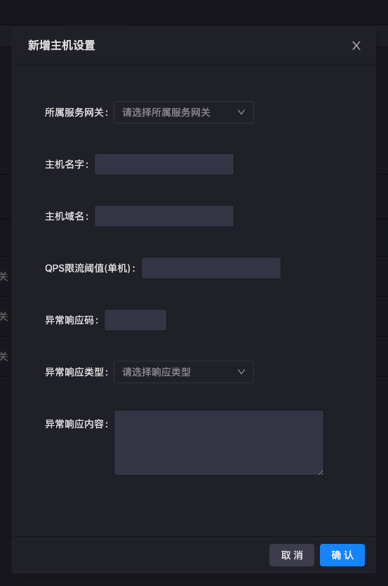
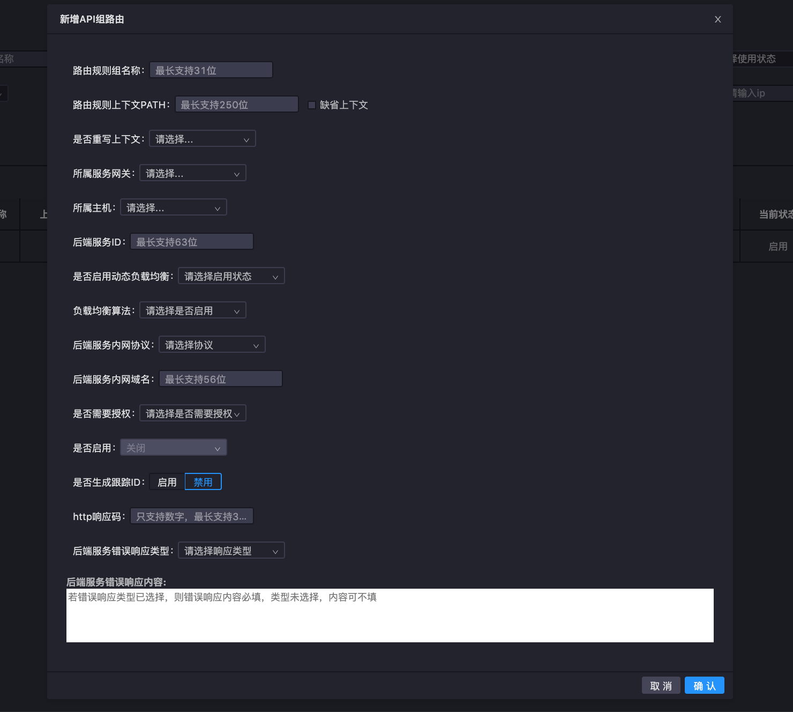
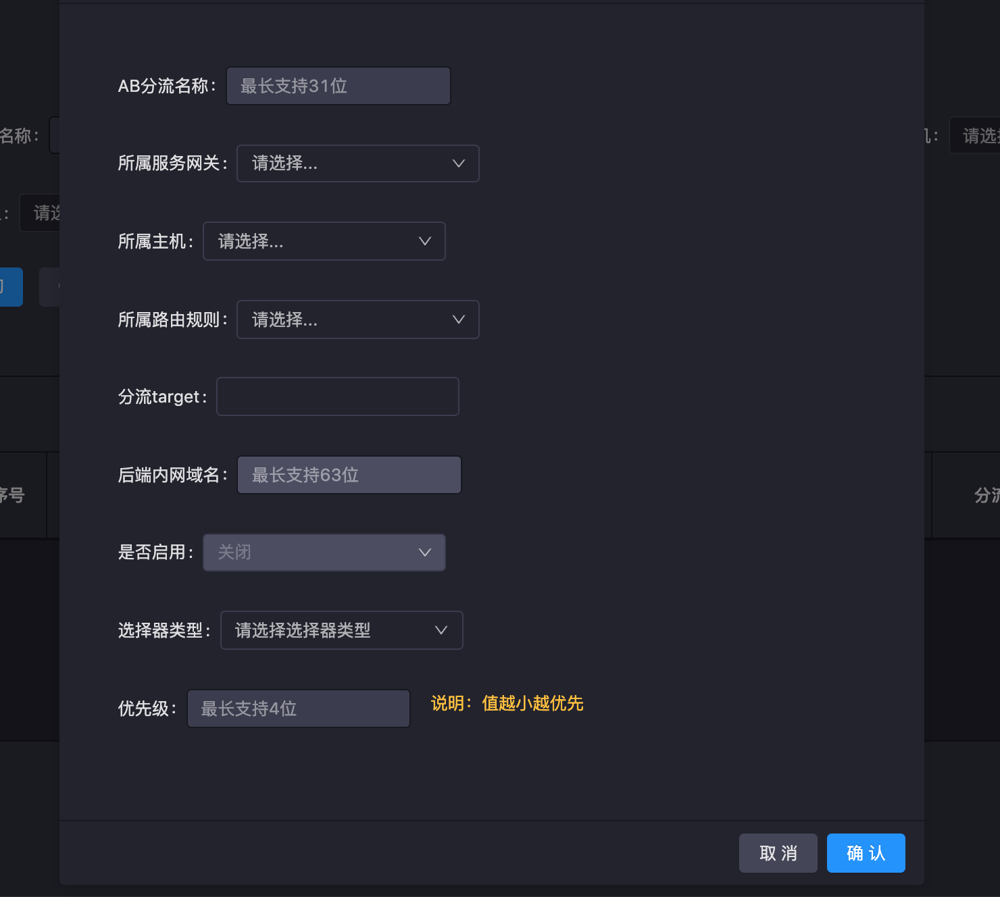
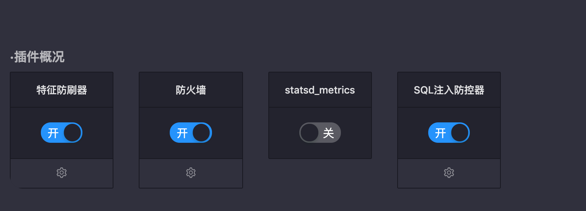

# NgrAdminPortal

NgrAdminPortal是ngr网关的管理portal，通过一个Portal页管理所有网关实例。Potral提供了网关集群管理、主机管理、路由管理、插件管理等功能。

## 页面概览

上图为NgrAdminPortal的主页面

- 左侧导航栏展示poratl的4类主要功能：运行概况、路由管理、插件管理、用户管理
- 主页面上方显示网关集群的基础信息
- 主页面下方显示当日请求的统计信息

## 路由管理

### 网关管理

网关管理页面提供网关集群的增删改查，新增网关时可以配置网关集群中ngr实例的QPS。异常响应域还可以定义上游无响应时的返回内容。

- 网关编码及网关名称：自定义的名称，用于标识网关集群。为了便于运维，一般取具有业务特性的名称。

- QPS限流：指定单ngr实例所允许的QPS，当QPS超阀值时，网关将返回默认异常响应；
- 异常码：当上游异常时，向客户端返回自定义的异常码；此处定义的是网关级别的异常返回码；
- 异常响应类型：当上游异常时，网关响应报文的头中的content-type；
- 异常响应内容：当上游异常时，网关响应报文的报文体；

### 主机管理

主机管理页面提供网关集群的增删改查，新增主机时可以配置主机的域名及QPS。异常响应域还可以定义上游无响应时的返回内容。

- 所属服务网关：指定主机所属的网关

- 主机名字：主机的描述性字段

- 主机域名：主机对应的域名，等效于nginx配置中的server_name

- QPS限流：主机级别的限流设置，当QPS超阀值时，网关将返回默认异常响应；

- 异常码：当上游异常时，向客户端返回自定义的异常码；此处定义的是主机级别的异常返回码；优先级高于网关级别异常码配置；
- 异常响应类型：当上游异常时，网关响应报文的头中的content-type；
- 异常响应内容：当上游异常时，网关响应报文的报文体；

### 路由管理

路由管理用于为主机添加路由规则，添加上游，设置限流规则等。

#### 添加路由规则

- 路由规则名称：路由规则的标识性描述
- 路由规则上下文：URL中的PATH部分，等效于nginx中的location

- 是否重写上下文：是否启用对PATH部分的重写
- 上下文重写为：指定需要重写成的PATH
- 所属服务网关：指定该路由规则所属的网关
- 所属主机：指定该路由规则所属的主机
- 后端服务ID：为upstream组指定一个名字
- 是否启用动态负载均衡：是否启用对upstream中的target使用负载均衡算法；若不启用，则默认使用服务组中的第一个target，当第一个不可用时，重试第二个，以此类推
- 负载均衡算法：目前支持roundrobin和ip_hash两种负载均衡算法
- 后端服务内网协议：支持http及https

- 后端服务内网域名：当禁用**动态负载均衡**时，本字段生效；当后端服务实例以域名方式提供时，需要使用本字段
- 是否需要授权：对接OAuth
- 是否生成跟踪ID：当启用该特性时，网关将在客户端请求报文的HTTP Header中插入TrackingID
- http响应码：当上游异常时，网关向客户端返回自定义的异常码；此处定义的是主机级别的异常返回码；优先级高于主机级别异常码配置；
- 后端服务错误响应类型：当上游异常时，网关响应报文的头中的content-type；
- 后端服务错误响应内容：当上游异常时，网关响应报文的报文体；

#### 添加限流规则及上游

添加完路由后，可以设置路由规则的限流规则及上游target

### AB分流

- AB分流名称：分流规则的标识性描述

- 所属网关：该分流规则所属的网关
- 所属主机：该分流规则所属的主机
- 所属路由规则：该分流规则对哪条路由规则生效
- 分流target：下拉多选框，用于在对应生效的路由规则中的target中选择
- 后端内网域名：当AB分流规则关联的路由规则中，定义的是内网域名的上游时，本字段生效
- 选择器类型：定义特征值之间的逻辑运算关系
- 优先级：定义分流规则的优先级

### 插件管理

插件管理模块用于控制插件的启停及插件的配置。

